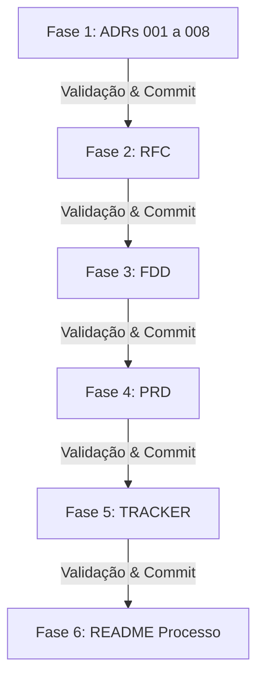

# Processo de Produção: Da Reunião ao Documento — Design Docs Gerados por IA

Este repositório contém o pacote completo de documentação técnica (Design Docs) para a nova funcionalidade de **Sistema de Webhooks de Notificação de Pedidos** do Order Management System (OMS). A documentação foi gerada utilizando Inteligência Artificial como ferramenta de produção, atuando em um fluxo estruturado de engenharia de prompts, análise crítica e validação contínua por etapas.

---

## 1. Sobre o Desafio

O desafio consiste em transformar a transcrição de uma reunião técnica de alinhamento (`TRANSCRICAO.md`) de ~55 minutos — envolvendo Tech Lead, Product Manager, Engenheiros de Pedidos/Plataforma e Engenheira de Segurança — e o código-fonte de um Order Management System (OMS) em Node.js/TypeScript com Prisma e MySQL, em um conjunto completo e acionável de documentos de engenharia de software.

O objetivo principal foi assumir o papel de maestro de IA: formular prompts dirigidos, analisar o código base existente, extrair decisões e restrições da transcrição (filtrando o que foi aprovado do que foi descartado/adiado), e produzir um pacote documental consistente sem inventar requisitos ou contradizer as especificações originais.

---

## 2. Ferramentas de IA Utilizadas

* **Google Antigravity IDE (Gemini 3.6 Flash):** Ferramenta principal de agentic AI responsável pela exploração da codebase, leitura da transcrição, geração incremental dos documentos em Markdown, análise de rastreabilidade e automação do controle de versão com Git.
* **Skills e Plugins Customizados de IA:** Utilização de habilidades de arquitetura e design de software para validação de padrões de projeto (Outbox Pattern, HMAC-SHA256, Backoff Exponencial, idempotência).

---

## 3. Workflow Adotado

O trabalho foi organizado em uma esteira de produção **incremental e iterativa por etapas**, com validação e commit individual para cada entregável:



1. **Exploração e Contextualização:** Leitura e indexação da transcrição (`TRANSCRICAO.md`) e inspeção dos arquivos-chave da codebase (`src/modules/orders/order.service.ts`, `prisma/schema.prisma`, `src/shared/errors/app-error.ts`, `src/middlewares/auth.middleware.ts`).
2. **ADRs Primeiro:** Produção de 8 Architecture Decision Records (ADRs) estabelecendo as fundações técnicas (Outbox, Polling Worker, Retry/DLQ, HMAC-SHA256, At-Least-Once, Reuso de Padrões, Limite 64KB e Obrigatoriedade HTTPS via Zod).
3. **RFC da Feature:** Consolidação da proposta técnica geral, documentando trade-offs de 2 alternativas descartadas na reunião e 2 questões em aberto, vinculando aos ADRs.
4. **FDD da Feature:** Detalhamento profundo de implementação, incluindo diagramas de sequência, especificação de 6 endpoints HTTP, matriz de erros `WEBHOOK_*` e a seção de integração com 5 arquivos reais do sistema.
5. **PRD da Feature:** Especificação de alto nível para produto/negócio, formalizando o problema, métricas quantitativas de sucesso, 10 requisitos funcionais e itens fora de escopo.
6. **Matriz de Rastreabilidade (TRACKER):** Mapeamento transversal de 43 itens vinculando os docs aos timestamps `[hh:mm] Nome` da transcrição e caminhos da codebase.
7. **README do Processo:** Consolidação da jornada no `README.md`.

---

## 4. Prompts Customizados

Abaixo estão apresentados dois dos prompts customizados principais desenvolvidos e adaptados durante o processo:

### Prompt 1: Extração Transversal de Decisões e Filtro de Descartes (ADRs & RFC)
```text
Você é um Arquiteto de Software Sênior especializado em sistemas distribuídos e NodeJS.
Analise a transcrição da reunião técnica em TRANSCRICAO.md e o código do projeto em src/ e prisma/.

Sua tarefa é extrair estritamente as decisões técnicas fechadas e as alternativas descartadas.
Regras de ouro:
1. NÃO invente requisitos ou decisões não citados na call ou no código.
2. Identifique explicitamente o que foi DESCARTADO (ex: disparo HTTP síncrono, Redis/RabbitMQ) e o motivo do descarte.
3. Identifique o que foi ADIADO/FORA DE ESCOPO (ex: e-mail de alerta, dashboard visual).
4. Para cada decisão fechada, formate um ADR no modelo MADR com: Status, Contexto, Decisão, Alternativas Consideradas e Consequências.
5. Garanta que pelo menos 1 ADR mencione caminhos reais de arquivos do projeto (ex: src/modules/orders/order.service.ts).
```

### Prompt 2: Validação de Rastreabilidade e Anti-Alucinação (TRACKER)
```text
Aja como um Auditor de Garantia de Qualidade de Documentação Técnica.
Analise os documentos gerados em docs/ (PRD.md, RFC.md, FDD.md, adrs/*.md) e compare linha por linha com TRANSCRICAO.md e o código-fonte em src/ e prisma/.

Gere a tabela markdown docs/TRACKER.md com o formato:
| ID | Documento | Tipo | Conteúdo (resumo) | Fonte | Localização |

Requisitos de validação:
- Para Fonte = TRANSCRICAO, a coluna Localização DEVE obrigatoriamente conter o formato '[hh:mm] Nome' extraído literalmente de TRANSCRICAO.md.
- Para Fonte = CODIGO, a coluna Localização DEVE conter o caminho de arquivo real (ex: src/shared/errors/app-error.ts).
- Se algum item nos documentos não possuir origem comprovada na transcrição ou no código, REMOVA ou AJUSTE o item do documento por ser uma alucinação.
- Mantenha pelo menos 70% das linhas apontando para TRANSCRICAO e pelo menos 5 linhas para CODIGO.
```

---

## 5. Iterações e Ajustes

Durante a produção com IA, foram necessários ciclos de revisão crítica e refinamento para evitar superficialidades e garantir aderência estrita às regras do desafio:

### Ajuste 1: Nível de Detalhamento e Separação de Fronteiras entre RFC e FDD
* **Problema Encontrado:** Na primeira tentativa de rascunho do RFC, a IA gerou os contratos HTTP completos com JSON de exemplo dentro do RFC, duplicando o conteúdo que pertencia ao FDD.
* **Correção Aplicada:** Reprompting com instrução explícita de escopo: o RFC deve ser conciso (2 a 4 páginas) e responder "o que propomos e por quê" (arquitetura e alternativas), enquanto o FDD responde "como construir em detalhe" (contratos HTTP, payloads, esquemas e matriz de erros `WEBHOOK_*`).

### Ajuste 2: Seção de Integração com o Código no FDD e Referências no ADR-006
* **Problema Encontrado:** O FDD gerado inicialmente fazia referências genéricas como "o serviço de pedidos" sem citar os arquivos específicos da codebase.
* **Correção Aplicada:** Realizada inspeção detalhada do código-fonte para injetar caminhos de arquivos reais e trechos exatos (como o método `changeStatus` em [`src/modules/orders/order.service.ts`](file:///Users/macbookpro/github/fullcycle-mba-ia-desafio-design-docs-com-ia/src/modules/orders/order.service.ts), a classe [`AppError`](file:///Users/macbookpro/github/fullcycle-mba-ia-desafio-design-docs-com-ia/src/shared/errors/app-error.ts) e os middlewares em [`src/middlewares/error.middleware.ts`](file:///Users/macbookpro/github/fullcycle-mba-ia-desafio-design-docs-com-ia/src/middlewares/error.middleware.ts) e [`src/middlewares/auth.middleware.ts`](file:///Users/macbookpro/github/fullcycle-mba-ia-desafio-design-docs-com-ia/src/middlewares/auth.middleware.ts)).

---

## 6. Como Navegar a Entrega

Todos os artefatos foram entregues no formato Markdown dentro do diretório `docs/`. Recomendamos a seguinte ordem de leitura para melhor compreensão do projeto:

1. **[ADRs (Architecture Decision Records)](file:///Users/macbookpro/github/fullcycle-mba-ia-desafio-design-docs-com-ia/docs/adrs/)**: Leia os 8 registros de decisão técnica em `docs/adrs/` para entender as fundações arquiteturais.
2. **[RFC (Request for Comments)](file:///Users/macbookpro/github/fullcycle-mba-ia-desafio-design-docs-com-ia/docs/RFC.md)**: Analise a proposta técnica consolidada, trade-offs de alternativas descartadas e questões em aberto.
3. **[FDD (Feature Design Document)](file:///Users/macbookpro/github/fullcycle-mba-ia-desafio-design-docs-com-ia/docs/FDD.md)**: Explore as especificações detalhadas de implementação, diagramas de sequência, contratos HTTP e integração com a codebase.
4. **[PRD (Product Requirement Document)](file:///Users/macbookpro/github/fullcycle-mba-ia-desafio-design-docs-com-ia/docs/PRD.md)**: Veja a visão de produto, requisitos funcionais/não funcionais, escopo e métricas quantitativas de sucesso.
5. **[TRACKER (Matriz de Rastreabilidade)](file:///Users/macbookpro/github/fullcycle-mba-ia-desafio-design-docs-com-ia/docs/TRACKER.md)**: Consulte a matriz de auditoria que conecta cada item dos documentos à transcrição (`TRANSCRICAO.md`) e ao código-fonte.
