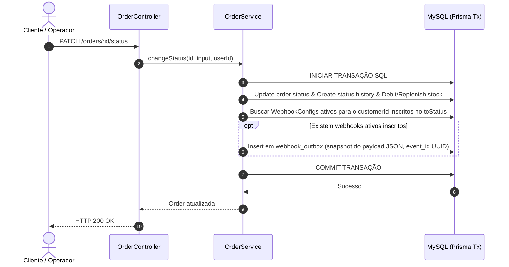
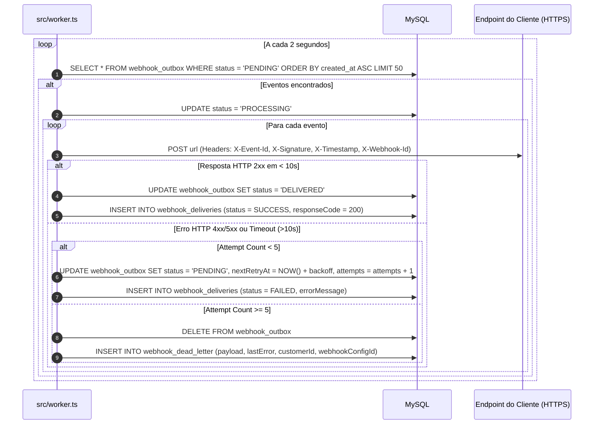

# FDD: Feature Design Document — Sistema de Webhooks de Notificação de Pedidos

* **Autor:** Bruno (Engenheiro Pleno) & Diego (Engenheiro Sênior)
* **Status:** Aprovado para Implementação
* **Data:** 2026-09-21
* **Versão:** 1.0.0

---

## 1. Contexto e Motivação Técnica

Atualmente, o módulo de pedidos (`src/modules/orders/`) gerencia as transações de alteração de status através de `OrderService.changeStatus`. Quando o status de um pedido é modificado (por exemplo, de `PENDING` para `PAID` ou `SHIPPED`), as alterações são persistidas no MySQL via Prisma, incluindo atualização da tabela `orders`, criação de registro em `order_status_history` e incremento/decremento de estoque em `products`.

Para atender aos requisitos de notificação assíncrona dos clientes B2B (Atlas Comercial, MaxDistribuição e Nova Cargo) sem degradação da performance da API HTTP, esta especificação detalha o desenho técnico da arquitetura de **Outbound Webhooks**.

---

## 2. Objetivos Técnicos

1. **Latência de Entrega:** Garantir o despacho dos webhooks em tempo inferior a 10 segundos (SLA de 2 a 3 segundos via polling de 2s).
2. **Consistência Transacional:** Assegurar que nenhum evento seja perdido ou gerado indevidamente através do padrão Transactional Outbox amarrado à transação SQL do pedido.
3. **Resiliência e Recuperação:** Implementar política de 5 retentativas com backoff exponencial (1m, 5m, 30m, 2h, 12h) e descarte em Dead Letter Queue (DLQ) com capacidade de reprocessamento manual via API administrativa.
4. **Segurança de Padrão de Mercado:** Autenticação por assinatura HMAC-SHA256 no header `X-Signature`, secret única por endpoint, suporte a rotação com *grace period* de 24h e validação rigorosa de URLs HTTPS.
5. **Reuso de Padrões da Codebase:** Integrar totalmente com as abstrações existentes de tratamento de erros (`AppError`), validação (`Zod`), logs (`Pino`) e ORM (`Prisma`).

---

## 3. Escopo e Exclusões

### Incluso no Escopo Técnico
* Tabela de configurações de webhook (`webhook_configs`).
* Tabela de eventos de outbox (`webhook_outbox`).
* Tabela de histórico de entregas (`webhook_deliveries`).
* Tabela de eventos mortos / DLQ (`webhook_dead_letter`).
* Novo ponto de entrada do processo worker em `src/worker.ts`.
* Módulo `src/modules/webhooks/` com controller, service, repository, routes e schemas Zod.
* Endpoints REST para CRUD de webhooks, rotação de secret, histórico de entregas e replay de DLQ.
* Integração transacional no método `OrderService.changeStatus`.

### Fora do Escopo Técnico
* Interface visual / Dashboard no frontend (gerenciamento exclusivo via API REST).
* Disparo de alertas ou e-mails automáticos quando webhooks falharem.
* Garantia de ordenação global entre diferentes pedidos.
* Ingestão de webhooks *inbound* (recebimento de chamadas de terceiros).

---

## 4. Fluxos Detalhados

### 4.1. Fluxo de Criação do Evento na Outbox (Ingestão)



### 4.2. Fluxo de Processamento pelo Worker, Retry e DLQ



---

## 5. Contratos Públicos

### 5.1. Headers Padrão Enviados nas Notificações HTTP (Outbound)

Toda requisição HTTP enviada pelo worker para o endpoint do cliente incluirá os seguintes cabeçalhos no request:

| Header | Descrição | Exemplo |
| :--- | :--- | :--- |
| `Content-Type` | Formato do corpo da requisição | `application/json` |
| `X-Event-Id` | UUID único do evento (usado para desduplicação/idempotência) | `9b1deb4d-3b7d-4bad-9bdd-2b0d7b3dcb6d` |
| `X-Webhook-Id` | UUID da configuração do webhook do cliente | `f47ac10b-58cc-4372-a567-0e02b2c3d479` |
| `X-Timestamp` | Timestamp ISO 8601 do envio da notificação | `2026-09-21T19:15:00.000Z` |
| `X-Signature` | Assinatura HMAC-SHA256 hexadecimal do payload | `sha256=a35f...8b21` |

---

### 5.2. Payload JSON de Notificação (Exemplo)

```json
{
  "eventId": "9b1deb4d-3b7d-4bad-9bdd-2b0d7b3dcb6d",
  "eventType": "order.status_changed",
  "timestamp": "2026-09-21T19:15:00.000Z",
  "data": {
    "orderId": "a1b2c3d4-e5f6-7a8b-9c0d-1e2f3a4b5c6d",
    "orderNumber": "ORD-000042",
    "customerId": "c1d2e3f4-5a6b-7c8d-9e0f-1a2b3c4d5e6f",
    "fromStatus": "PENDING",
    "toStatus": "PAID",
    "totalCents": 15000,
    "updatedAt": "2026-09-21T19:14:58.000Z"
  }
}
```

---

### 5.3. Endpoints REST da API (Inbound / Gestão)

#### Endpoint 1: Criar Configuração de Webhook
* **Rota:** `POST /webhooks`
* **Autenticação:** Requer JWT (`requireAuth`)
* **Request Body:**
```json
{
  "customerId": "c1d2e3f4-5a6b-7c8d-9e0f-1a2b3c4d5e6f",
  "url": "https://api.atlascomercial.com.br/v1/webhooks/orders",
  "events": ["PAID", "PROCESSING", "SHIPPED", "DELIVERED", "CANCELLED"],
  "description": "Endpoint de notificação do ERP Atlas"
}
```
* **Response Body (HTTP 201 Created):**
```json
{
  "id": "f47ac10b-58cc-4372-a567-0e02b2c3d479",
  "customerId": "c1d2e3f4-5a6b-7c8d-9e0f-1a2b3c4d5e6f",
  "url": "https://api.atlascomercial.com.br/v1/webhooks/orders",
  "events": ["PAID", "PROCESSING", "SHIPPED", "DELIVERED", "CANCELLED"],
  "secret": "whsec_7f9a8b1c2d3e4f5a6b7c8d9e0f1a2b3c",
  "active": true,
  "createdAt": "2026-09-21T19:15:00.000Z"
}
```
* **Status Codes:** `201 Created`, `400 Bad Request` (URL inválida ou HTTP), `401 Unauthorized`, `404 Not Found` (Customer não existe).

---

#### Endpoint 2: Listar Webhooks por Cliente
* **Rota:** `GET /webhooks?customerId=c1d2e3f4-5a6b-7c8d-9e0f-1a2b3c4d5e6f`
* **Autenticação:** Requer JWT (`requireAuth`)
* **Response Body (HTTP 200 OK):**
```json
{
  "data": [
    {
      "id": "f47ac10b-58cc-4372-a567-0e02b2c3d479",
      "customerId": "c1d2e3f4-5a6b-7c8d-9e0f-1a2b3c4d5e6f",
      "url": "https://api.atlascomercial.com.br/v1/webhooks/orders",
      "events": ["PAID", "SHIPPED"],
      "active": true,
      "createdAt": "2026-09-21T19:15:00.000Z"
    }
  ],
  "meta": {
    "page": 1,
    "pageSize": 20,
    "total": 1
  }
}
```
* **Status Codes:** `200 OK`, `401 Unauthorized`.

---

#### Endpoint 3: Remover / Desativar Webhook
* **Rota:** `DELETE /webhooks/:id`
* **Autenticação:** Requer JWT (`requireAuth`)
* **Response Body (HTTP 204 No Content):** *Vazio*
* **Status Codes:** `204 No Content`, `401 Unauthorized`, `404 Not Found` (`WEBHOOK_NOT_FOUND`).

---

#### Endpoint 4: Listar Histórico de Entregas do Webhook
* **Rota:** `GET /webhooks/:id/deliveries?page=1&pageSize=20`
* **Autenticação:** Requer JWT (`requireAuth`)
* **Response Body (HTTP 200 OK):**
```json
{
  "data": [
    {
      "id": "e8d7c6b5-a432-10fe-dcba-9876543210fe",
      "webhookConfigId": "f47ac10b-58cc-4372-a567-0e02b2c3d479",
      "eventId": "9b1deb4d-3b7d-4bad-9bdd-2b0d7b3dcb6d",
      "responseStatusCode": 200,
      "executionTimeMs": 145,
      "status": "SUCCESS",
      "errorMessage": null,
      "deliveredAt": "2026-09-21T19:15:02.000Z"
    }
  ],
  "meta": { "page": 1, "pageSize": 20, "total": 1 }
}
```
* **Status Codes:** `200 OK`, `401 Unauthorized`, `404 Not Found`.

---

#### Endpoint 5: Rotacionar Secret do Webhook
* **Rota:** `POST /webhooks/:id/rotate-secret`
* **Autenticação:** Requer JWT (`requireAuth`)
* **Response Body (HTTP 200 OK):**
```json
{
  "id": "f47ac10b-58cc-4372-a567-0e02b2c3d479",
  "newSecret": "whsec_99887766554433221100aabbccddeeff",
  "oldSecretGracePeriodExpiresAt": "2026-09-22T19:15:00.000Z"
}
```
* **Status Codes:** `200 OK`, `401 Unauthorized`, `404 Not Found`.

---

#### Endpoint 6: Replay Manual de Evento da DLQ (Admin)
* **Rota:** `POST /admin/webhooks/dead-letter/:id/replay`
* **Autenticação:** Requer JWT com Role `ADMIN` (`requireRole(UserRole.ADMIN)`)
* **Response Body (HTTP 200 OK):**
```json
{
  "message": "Event re-enqueued to outbox successfully",
  "deadLetterId": "d1d2d3d4-e5f6-7a8b-9c0d-1e2f3a4b5c6d",
  "newOutboxEventId": "9b1deb4d-3b7d-4bad-9bdd-2b0d7b3dcb6d"
}
```
* **Status Codes:** `200 OK`, `401 Unauthorized`, `403 Forbidden` (se usuário for OPERATOR), `404 Not Found`.

---

## 6. Matriz de Erros Previstos

Todos os erros lançados pelo módulo de webhooks utilizarão a classe `AppError` e retornarão o código formatado no padrão `WEBHOOK_*`:

| Código de Erro | Status HTTP | Descrição / Causa | Exemplo de Mensagem |
| :--- | :--- | :--- | :--- |
| `WEBHOOK_NOT_FOUND` | 404 | Configuração de webhook não encontrada pelo ID | `Webhook configuration not found` |
| `WEBHOOK_INVALID_URL` | 400 | URL informada é inválida ou utiliza protocolo HTTP em vez de HTTPS | `Webhook URL must be a valid HTTPS URL` |
| `WEBHOOK_SECRET_REQUIRED` | 400 | Tentativa de atualizar ou assinar sem a secret | `Webhook secret is required for signing` |
| `WEBHOOK_PAYLOAD_TOO_LARGE` | 422 | O payload formatado ultrapassou o limite máximo de 64KB | `Webhook payload size exceeds maximum limit of 64KB` |
| `WEBHOOK_ALREADY_EXISTS` | 409 | Já existe um webhook cadastrado com a mesma URL para este cliente | `Webhook with this URL already exists for customer` |
| `WEBHOOK_UNAUTHORIZED` | 401 | Usuário não autenticado tentando acessar recursos de webhook | `Authentication required to manage webhooks` |
| `WEBHOOK_FORBIDDEN` | 403 | Usuário sem permissão de ADMIN tentando executar replay de DLQ | `Admin role required for DLQ operations` |

---

## 7. Estratégias de Resiliência

1. **Timeout Estrito por Chamada HTTP:** O worker definirá um timeout de **10 segundos** (`timeout: 10000`) para cada requisição HTTP enviada ao cliente. Respostas que excederem esse tempo serão abortadas e contadas como falha.
2. **Teto de Tamanho de Payload:** Limite máximo de **64 KB** por mensagem. Se um evento exceder esse limite, o registro falhará com `WEBHOOK_PAYLOAD_TOO_LARGE` e será descartado com alerta no log.
3. **Progressão de Backoff Exponencial:**
   * Tentativa 1: Imadiata (no polling seguinte)
   * Tentativa 2: +1 minuto
   * Tentativa 3: +5 minutos
   * Tentativa 4: +30 minutos
   * Tentativa 5: +2 horas
   * Tentativa 6 (Final): +12 horas
4. **Isolamento de Erros no Worker:** A falha no envio de um webhook para o cliente A jamais afetará o envio ou a fila do cliente B.

---

## 8. Observabilidade

* **Logs Estruturados (Pino):**
  * Toda tentativa de disparo pelo worker será registrada com o logger Pino ([`src/shared/logger/index.ts`](file:///Users/macbookpro/github/fullcycle-mba-ia-desafio-design-docs-com-ia/src/shared/logger/index.ts)), contendo os campos: `eventId`, `webhookConfigId`, `customerId`, `orderId`, `attempt`, `statusCode`, `executionTimeMs`.
* **Métricas de Performance e Saúde:**
  * Quantidade de eventos em estado `PENDING` na outbox (tamanho da fila).
  * Taxa de sucesso vs. falha de entregas por cliente.
  * Latência média de resposta dos endpoints clientes.
  * Quantidade de eventos direcionados para a `webhook_dead_letter`.

---

## 9. Integração com o Sistema Existente

Esta seção é **obrigatória** e mapeia explicitamente como o novo módulo de webhooks se conecta com a estrutura de arquivos e código-fonte atual do projeto:

### 1. `src/modules/orders/order.service.ts`
* **Como será estendido:** O método `changeStatus` (linhas 126-179) gerencia as transações de alteração de pedido. Injetaremos a chamada à função de auxílio `publishWebhookEvent(tx, order, from, to)` dentro do bloco `this.prisma.$transaction(async (tx) => { ... })`. A gravação da outbox utilizará o mesmo cliente transacional `tx`, garantindo atomicidade com as tabelas `orders`, `order_status_history` e `products`.

### 2. `prisma/schema.prisma`
* **Como será estendido:** O arquivo de esquema do Prisma será atualizado com os novos modelos:
  * `WebhookConfig`: armazena `id` (UUID), `customerId`, `url`, `secret`, `oldSecret`, `gracePeriodExpiresAt`, `events` (Json), `active`, `createdAt`.
  * `WebhookOutbox`: armazena `id` (UUID), `eventId`, `customerId`, `payload` (Json), `status` (PENDING, PROCESSING, DELIVERED), `attempts`, `nextRetryAt`, `createdAt`.
  * `WebhookDelivery`: armazena o histórico de tentativas de despacho HTTP.
  * `WebhookDeadLetter`: armazena eventos que falharam após 5 tentativas.

### 3. `src/shared/errors/app-error.ts` e `src/shared/errors/index.ts`
* **Como será estendido:** As classes de erro base do projeto serão reutilizadas. Criaremos a classe `WebhookError` estendendo `AppError` e exportaremos no index de erros para ser consumida em todo o novo módulo `src/modules/webhooks/`.

### 4. `src/middlewares/error.middleware.ts`
* **Como será estendido:** O middleware centralizado de tratamento de exceções da aplicação tratará nativamente os erros do tipo `WebhookError`, extraindo os códigos `WEBHOOK_*` e retornando as respostas HTTP estruturadas padrão do sistema sem necessidade de alterações na camada de middleware.

### 5. `src/middlewares/auth.middleware.ts`
* **Como será estendido:** As rotas em `src/modules/webhooks/webhook.routes.ts` utilizarão diretamente as funções `requireAuth` para autenticação JWT e `requireRole(UserRole.ADMIN)` para o endpoint administrativo de replay da DLQ (`POST /admin/webhooks/dead-letter/:id/replay`).

---

## 10. Dependências e Compatibilidade

* **Runtime:** Node.js v18+ com TypeScript.
* **ORM:** Prisma Client v5+.
* **Banco de Dados:** MySQL 8.0+.
* **Framework Web:** Express v4+.
* **Validação:** Zod.
* **Logger:** Pino.

---

## 11. Critérios de Aceite Técnicos

1. A gravação do evento na outbox ocorre **estritamente dentro da transação SQL** de alteração de status do pedido.
2. O worker roda como processo separado (`src/worker.ts`) e consome a outbox a cada 2 segundos.
3. Todas as requisições HTTP enviadas contêm os cabeçalhos `X-Event-Id`, `X-Webhook-Id`, `X-Timestamp` e `X-Signature` (HMAC-SHA256).
4. O sistema executa até 5 retentativas com a progressão de tempo especificada antes de mover o evento para a tabela DLQ.
5. O endpoint `POST /admin/webhooks/dead-letter/:id/replay` é restrito à role `ADMIN` e re-enfileira com sucesso eventos da DLQ.
6. URLs cadastradas com `http://` são rejeitadas na validação com código `WEBHOOK_INVALID_URL`.

---

## 12. Riscos e Mitigação

| Risco | Impacto | Probabilidade | Mitigação |
| :--- | :--- | :--- | :--- |
| Accumulo excessivo de registros na tabela `webhook_outbox` | Médio | Média | O worker remove ou atualiza registros processados e os índices garantem consultas rápidas. |
| Timeout e travamento do worker em requisições lentas | Alto | Baixa | Timeout estrito de 10s configurado em cada chamada HTTP externa. |
| Vazamento de secrets em logs da aplicação | Alto | Baixa | Mascaramento de secrets nos logs estruturados do Pino e omissão no retorno de listagens públicas. |
