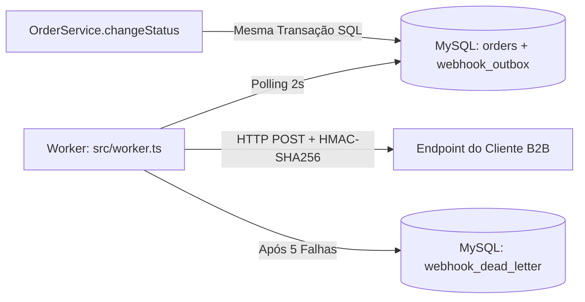

# RFC: Sistema de Webhooks de Notificação de Pedidos

* **Autor:** Bruno (Engenheiro Pleno) & Diego (Engenheiro Sênior)
* **Status:** Em Revisão (Submetido)
* **Data de Submissão:** 2026-09-21
* **Revisores:** Larissa (Tech Lead), Marcos (Product Manager), Sofia (Engenheira de Segurança)

---

## 1. Resumo Executivo (TL;DR)

Este RFC propõe a arquitetura para o **Sistema de Webhooks de Notificação de Pedidos (Outbound Webhooks)** no Order Management System (OMS). A solução permitirá notificar clientes B2B (como Atlas Comercial, MaxDistribuição e Nova Cargo) em tempo real (< 10 segundos) sempre que o status de um pedido for alterado na plataforma.

A abordagem escolhida utiliza o **Padrão Transactional Outbox no MySQL existente**, com gravações atômicas de eventos durante as alterações de status de pedidos. Um **Worker dedicado em processo Node.js separado** consumirá a outbox a cada 2 segundos e efetuará a entrega com autenticação criptográfica **HMAC-SHA256**, política de **5 retentativas com backoff exponencial** (cobrindo até 15h) e encaminhamento de falhas persistentes para uma **Dead Letter Queue (DLQ)**.

---

## 2. Contexto e Problema

Atualmente, o OMS não possui qualquer mecanismo de notificação externa ou eventos orientados a push. Três dos nossos principais clientes B2B — Atlas Comercial, MaxDistribuição e Nova Cargo — necessitam acompanhar o fluxo de vida de seus pedidos em tempo real.

Na ausência de notificações ativas, esses clientes realizam *polling* intenso e contínuo no endpoint `GET /orders`. Essa abordagem gera:
* Alta sobrecarga inútil na nossa infraestrutura e banco de dados.
* Latência percebida e experiência degradada para os clientes.
* Risco comercial imediato: o cliente Atlas Comercial formalizou que a ausência desta funcionalidade até o fim do trimestre pode motivar sua migração para um concorrente.

Precisamos implementar um canal outbound de webhooks robusto, seguro, resiliente e de baixa latência, mantendo a simplicidade operacional e a integridade transacional do OMS.

---

## 3. Proposta Técnica (Visão Geral)

A solução proposta divide-se em três pilares fundamentais: Ingestão Atômica, Processamento Assíncrono e Segurança/Resiliência.

### 3.1. Ingestão Atômica (Outbox Pattern)
No momento em que o status do pedido é alterado (`OrderService.changeStatus`), a notificação é convertida em um payload JSON estruturado e gravada na tabela `webhook_outbox` dentro da **mesma transação SQL do Prisma**. Isso garante que a notificação só seja enfileirada se a alteração do pedido for efetivada com sucesso.

### 3.2. Processador em Segundo Plano (Worker Isolado)
Um processo Node.js independente (`src/worker.ts`), executando separadamente da API HTTP principal, realiza *polling* a cada 2 segundos na tabela `webhook_outbox`, busca batches de eventos pendentes e dispara as requisições HTTP para as URLs cadastradas para o cliente correspondente.

### 3.3. Entrega, Resiliência e Segurança
* **Assinatura HMAC-SHA256:** Cada requisição leva o cabeçalho `X-Signature` gerado com a chave secreta exclusiva do endpoint do cliente, garantindo autenticidade e integridade.
* **Garantia At-Least-Once:** As entregas garantem pelo menos uma tentativa bem-sucedida. O cabeçalho `X-Event-Id` (UUID) é enviado em cada requisição para permitir que o cliente realize desduplicação idempotente.
* **Retry com Backoff:** Falhas temporárias são retentadas até 5 vezes nos intervalos de 1m, 5m, 30m, 2h e 12h. Falhas definitivas são movidas para a `webhook_dead_letter` (DLQ) para análise e replay manual via API administrativa.

---

## 4. Alternativas Consideradas

Durante a reunião técnica de arquitetura, duas alternativas principais foram analisadas e descartadas em favor da solução Outbox no MySQL:

### 4.1. Disparo de Webhook Síncrono no `OrderService.changeStatus`
* **Descrição:** Realizar a chamada HTTP `fetch()` diretamente dentro do método de serviço que altera o status do pedido.
* **Trade-off e Razão do Descarte:** Uma chamada HTTP síncrona prenderia a conexão do banco MySQL. Clientes com servidores lentos ou fora do ar causariam *timeouts* e travamentos na alteração de status do OMS, afetando outros pedidos e usuários. Além disso, uma falha de rede do cliente não deve cancelar um pedido cuja mudança de status já foi concluída no domínio do OMS.

### 4.2. Uso de Broker Externo de Mensageria (Redis Streams / RabbitMQ)
* **Descrição:** Publicar o evento de mudança de status em um cluster Redis Streams ou fila RabbitMQ para consumo por workers.
* **Trade-off e Razão do Descarte:** Exigiria provisionamento, configuração e monitoramento de nova infraestrutura de nuvem para uma equipe pequena. Adicionalmente, publicar diretamente em uma fila externa sem o padrão outbox reacenderia o problema do *dual-write* (o banco efetiva a transação mas a publicação na fila falha, ou vice-versa). O uso da tabela Outbox no MySQL existente resolve a consistência transacional sem custo de nova infraestrutura.

---

## 5. Questões em Aberto

Os seguintes pontos foram discutidos na reunião técnica mas deixados abertos ou adiados para avaliação posterior:

### 5.1. Rate Limiting de Saída por Cliente
* **Descrição:** Se um cliente possuir 50 pedidos mudando de status em um intervalo de poucos segundos (ex: atualização em massa por lote), o worker disparará 50 requisições HTTP simultâneas para o servidor do cliente.
* **Encaminhamento:** Inicialmente não aplicaremos *rate limiting* ou agrupamento de disparo de saída. O comportamento do tráfego será observado durante a primeira fase em produção para avaliar se algum servidor cliente será sobrecarregado antes de implementar controle de vazão.

### 5.2. Alertas Automáticos por E-mail em Caso de Falhas Continuas
* **Descrição:** Notificar o contato técnico do cliente por e-mail quando seu webhook falhar repetidamente (ex: 3 falhas consecutivas ou ida para DLQ).
* **Encaminhamento:** Envio de e-mails de alerta foi classificado como fora do escopo da entrega inicial. O monitoramento será feito via logs e pelo histórico de entregas disponível no endpoint `GET /webhooks/:id/deliveries`. Notificações por e-mail poderão ser priorizadas em uma fase futura.

---

## 6. Impacto e Riscos

* **Impacto em Banco de Dados:** Aumento na frequência de gravações e consultas na base MySQL. Mitigado por índices dedicados em `(status, created_at)` e arquivamento futuro de dados históricos.
* **Segurança de Credentials:** A secret do webhook é gerada com alta entropia e exposta ao cliente apenas no momento da criação/rotação. Suporte a rotação com *grace period* de 24 horas garante transição segura.
* **Disponibilidade da API de Pedidos:** Risco zero de degradação da API principal de pedidos, pois o consumo e envio ocorrem em um processo isolado (`src/worker.ts`).

---

## 7. Decisões Relacionadas (ADRs)

As decisões arquiteturais detalhadas que sustentam esta proposta estão formalmente registradas nos seguintes documentos:

* [ADR-001: Padrão Outbox no MySQL para Notificação de Webhooks](file:///Users/macbookpro/github/fullcycle-mba-ia-desafio-design-docs-com-ia/docs/adrs/ADR-001-outbox-no-mysql.md)
* [ADR-002: Worker em Processo Separado com Polling de 2 Segundos](file:///Users/macbookpro/github/fullcycle-mba-ia-desafio-design-docs-com-ia/docs/adrs/ADR-002-worker-em-processo-separado-em-polling.md)
* [ADR-003: Política de Retry com Backoff Exponencial e Dead Letter Queue (DLQ)](file:///Users/macbookpro/github/fullcycle-mba-ia-desafio-design-docs-com-ia/docs/adrs/ADR-003-politica-de-retry-com-backoff-e-dlq.md)
* [ADR-004: Autenticação HMAC-SHA256 com Secret Única por Endpoint e Suporte a Rotação](file:///Users/macbookpro/github/fullcycle-mba-ia-desafio-design-docs-com-ia/docs/adrs/ADR-004-autenticacao-hmac-sha256-com-secret-por-endpoint.md)
* [ADR-005: Garantia de Entrega At-Least-Once com Header X-Event-Id para Idempotência](file:///Users/macbookpro/github/fullcycle-mba-ia-desafio-design-docs-com-ia/docs/adrs/ADR-005-garantia-at-least-once-com-x-event-id.md)
* [ADR-006: Reuso dos Padrões Arquiteturais e Estruturais Existentes do Projeto](file:///Users/macbookpro/github/fullcycle-mba-ia-desafio-design-docs-com-ia/docs/adrs/ADR-006-reuso-dos-padroes-existentes-do-projeto.md)
* [ADR-007: Limite Máximo de Tamanho de Payload em 64KB](file:///Users/macbookpro/github/fullcycle-mba-ia-desafio-design-docs-com-ia/docs/adrs/ADR-007-limite-maximo-de-payload-em-64kb.md)
* [ADR-008: Obrigatoriedade de URLs HTTPS via Validação Zod](file:///Users/macbookpro/github/fullcycle-mba-ia-desafio-design-docs-com-ia/docs/adrs/ADR-008-obrigatoriedade-de-https-via-zod.md)
